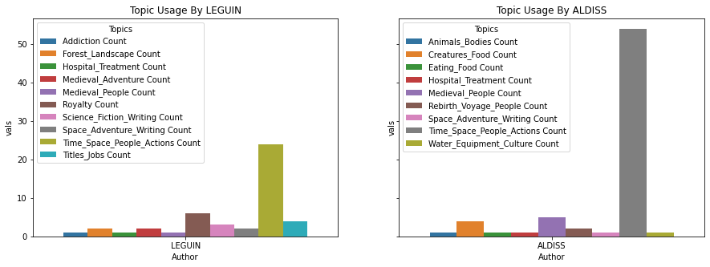

# BERTopic Output 

Here are some visualizations from BERTopic analysis of the Round 3 (Climate Fiction) texts. Prior to analysis, these texts were split into 1000-word "chunks" per chapter, since BERTopic does better with smaller pieces of data. These texts were kept in aggregated form and all non-English words were removed. Stopwords were removed after BERTopic analysis occurred.

[Access list of 68 topics (named manually) here](https://github.com/SF-Nexus/extracted-features/blob/main/data/BERTopic_output/Named_BERTopic_Topics.csv).

## Word Clouds with Most Common Words Per Topic
Topic 6: Street and Vehicles

Topic 17: Disease Outbreak

Topic 27: Desert Landscape Exploration

Topic 61: Air Pollution

## Topic Usage Comparison Between Authors

Topics Used By Brian Aldiss vs. Ursula Leguin

